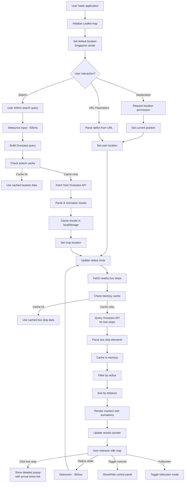

# SG Nearby Bus Stops

A modern web application that displays nearby bus stops in Singapore on an interactive map, built with vanilla JavaScript and Leaflet.

## Demo

https://yapweijun1996.github.io/Nearby-Bus-stop/

## Preview


## Features

-   **Locate Me**: Automatically detects and displays your current location on the map with high accuracy geolocation.
-   **Location Search**: Advanced search functionality with fuzzy matching and intelligent result ranking using Overpass API.
-   **Adjustable Radius**: Interactive radius slider (100m to 2000m) with real-time visual feedback and smooth animations.
-   **Bus Stop Details**: Click on bus stop markers to view detailed information including bus stop code, name, distance, and direct links to real-time arrival times.
-   **Fullscreen Mode**: Immersive fullscreen viewing experience for enhanced map exploration.
-   **Mobile Responsive**: Fully optimized for mobile devices with touch-friendly controls, responsive design, and safe area support.
-   **Modern UI**: Clean, modern interface with custom-styled popups, zoom controls, smooth animations, and glassmorphism effects.
-   **URL Sharing**: Share specific locations via URL parameters (e.g., `?lat=1.283&lon=103.860`).
-   **Performance Optimized**: Intelligent caching system with memory and localStorage for improved performance and reduced API calls.
-   **Accessibility**: Full keyboard navigation support, ARIA labels, screen reader compatibility, and high contrast mode support.
-   **Error Handling**: Comprehensive error handling with user-friendly messages and graceful fallbacks.
-   **Loading States**: Professional loading indicators with progress feedback and smooth transitions.
-   **Progressive Web App**: Installable on iOS, iPadOS, Android, and desktop with app manifest, local icons, service worker caching, and an offline fallback page.

## Codebase Review Notes

Last reviewed: **2026-06-22**

- The main application is implemented entirely in `index.html` (HTML/CSS + JS), with no build tooling required. Splitting the CSS and JS into separate files is the next maintainability step.
- Duplicate `#toggleBtn` / `#fullscreenBtn` click handlers and the dead retry-wrapper functions have been consolidated; each control is now bound once.
- Text from OpenStreetMap (`name`, `ref`) is escaped before insertion into the DOM to prevent HTML/script injection.
- Leaflet is pinned to `1.9.4` (with Subresource Integrity) instead of an unpinned `latest` URL, so an upstream release cannot break the app.
- The "View Times" arrival link is shown only when a stop has a valid 5-digit LTA code, avoiding dead links for OSM nodes without a `ref`.
- For reliable geolocation on modern browsers, the app should be served over HTTPS or `localhost`; direct file access may block location permission in some environments.
- The app includes baseline PWA files (`manifest.webmanifest`, `service-worker.js`, `offline.html`, and local icons) so GitHub Pages can serve it as an installable web app.

## Technologies

- **Frontend**: HTML5, CSS3, Vanilla JavaScript (ES6+)
- **Mapping**: [Leaflet](https://leafletjs.com/) - Open-source JavaScript library for interactive maps
- **Geocoding & Data**: [Overpass API](https://wiki.openstreetmap.org/wiki/Overpass_API) - Real-time OpenStreetMap data querying
- **Performance**: Multi-layer caching system (memory cache + localStorage) with intelligent cache management
- **APIs**: Modern Fetch API with comprehensive error handling and timeout management

## Local Bus Stop Dataset (optional, recommended)

The app can run **fully offline for nearby lookups** by bundling the complete list
of Singapore bus stops as a static `bus-stops.jsonl` file (one JSON object per line):

```jsonl
{"code":"07379","name":"Aperia/Before Kallang Road","road":"Kallang Road","lat":1.2821,"lon":103.8591}
```

Behaviour is automatic:

- **If `bus-stops.jsonl` is present**, "nearby" is computed locally (instant, no API,
  works offline, every stop has a valid LTA code), and the search box matches local
  stops by code or name first.
- **If it is absent**, the app falls back to the live Overpass API (no change).

### Generating the file from LTA DataMall

1. Get a free AccountKey from [LTA DataMall](https://datamall.lta.gov.sg/content/datamall/en/request-for-api.html).
2. Run the generator (fetches all stops, pages of 500, and writes `bus-stops.jsonl`):

   ```bash
   node scripts/build-stops.cjs <YOUR_ACCOUNT_KEY>
   # or: LTA_ACCOUNT_KEY=xxxx node scripts/build-stops.cjs
   ```

3. Commit `bus-stops.jsonl` so GitHub Pages serves it. Re-run occasionally to refresh
   (the SG bus-stop list changes rarely). Data is under the Singapore Open Data Licence.

## Data Source

Bus stop data is dynamically fetched in real-time using the [Overpass API](https://wiki.openstreetmap.org/wiki/Overpass_API), which queries OpenStreetMap data for Singapore including:
- Bus stop codes (ref tags)
- Bus stop names and descriptions
- Geographic coordinates (latitude and longitude)
- Real-time data availability

The application queries for `highway=bus_stop` and `public_transport=platform` nodes within the specified radius around the user's location, ensuring always up-to-date information without requiring manual data updates.

## Technical Implementation

### Application Flow Diagram



### Architecture Overview

The application uses a modern, real-time architecture with dynamic data fetching and intelligent caching:

### Real-Time Data Fetching

**Overpass API Integration:**
- Queries OpenStreetMap data in real-time using the Overpass API
- Searches for `highway=bus_stop` and `public_transport=platform` nodes within specified radius
- Constructs intelligent regex patterns for fuzzy location matching
- Handles API timeouts and errors gracefully with user-friendly feedback

**Advanced Search System:**
- Implements fuzzy search with token-based pattern matching
- Supports partial word matching and intelligent result ranking
- Caches search results in localStorage for improved performance
- Debounced search requests to prevent API spam

### Multi-Layer Caching System

**Performance Optimizations:**
- **Memory Cache**: In-memory Map object for bus stop data with 5-minute expiry
- **localStorage Cache**: Persistent storage for search results and frequently accessed data
- **Debounced Operations**: 300ms debounce on radius changes, 500ms debounce on search
- **Request Deduplication**: Prevents duplicate API calls when already loading

**Cache Management:**
- Automatic cache size limits (50 entries for memory cache)
- Intelligent cache invalidation based on timestamps
- Graceful fallback when cache is unavailable

### Location Processing Logic

**User Location Detection:**
- Primary method: Browser Geolocation API with high accuracy settings
- Fallback method: URL parameters (`?lat=1.283&lon=103.860`)
- Default location: Singapore center coordinates (1.283, 103.860)
- Comprehensive error handling for different geolocation failure modes

**Bus Stop Filtering & Rendering:**
- Real-time filtering using Leaflet's distance calculation methods
- Dynamic marker creation with staggered animations for smooth UX
- Distance-based sorting for optimal user experience
- Automatic results counter with live updates

### Advanced Features Implementation

**Accessibility Features:**
- Full keyboard navigation support with proper focus management
- ARIA labels and live regions for screen readers
- High contrast mode support for users with visual impairments
- Reduced motion support for users with vestibular disorders

**Modern UI Features:**
- CSS custom properties (CSS variables) for consistent theming
- Glassmorphism effects with backdrop filters
- Smooth animations with cubic-bezier easing functions
- Mobile-first responsive design with safe area support

### Key Functions

**Core Functions:**
- `fetchBusStops(lat, lon, radius, callback)`: Fetches bus stop data from Overpass API
- `fetchBusStopsWithCache(lat, lon, radius, callback, cacheKey)`: Cached version with performance optimization
- `setUser(pos)`: Sets user location and triggers comprehensive updates
- `renderStops()`: Advanced filtering and rendering with animations
- `buildOverpassSearchQuery(query)`: Constructs intelligent search patterns
- `performSearch(query)`: Handles location search with caching and error handling

**Utility Functions:**
- `showLoadingState(message)`: Professional loading indicators with animations
- `showMessage(message, type)`: Advanced notification system with different types
- `normalizeOverpassElements(elements)`: Data processing and normalization
- `extractCoordinates(item)`: Robust coordinate extraction from various data formats

**User Interaction:**
- `locateMe()`: Enhanced geolocation with comprehensive error handling
- `searchLocation()`: Debounced search with intelligent result processing
- `loadStops()`: Initial data loading and application bootstrap

### Performance & Caching

**Intelligent Caching Strategy:**
- **Memory Cache**: Bus stop data cached in Map object with 5-minute expiry for instant subsequent loads
- **Search Cache**: Location search results cached in localStorage for 5 minutes to reduce API calls
- **Cache Management**: Automatic cleanup with size limits (50 entries) and intelligent invalidation
- **Offline Support**: Graceful degradation when network is unavailable

**Performance Optimizations:**
- **Debounced Operations**: 300ms debounce on radius slider, 500ms debounce on search input
- **Request Deduplication**: Prevents multiple simultaneous API calls for the same data
- **Staggered Animations**: Smooth marker animations with 50ms delays to prevent UI blocking
- **Efficient DOM Updates**: Minimal DOM manipulation with batch updates where possible

**API Rate Limiting:**
- Built-in protection against API spam with intelligent request timing
- Automatic retry logic with exponential backoff for failed requests
- Comprehensive error handling with user-friendly feedback messages

## Build & Develop (Vite)

The project uses [Vite](https://vitejs.dev/). Static assets live in `public/`
(`bus-stops.jsonl`, `manifest.webmanifest`, `service-worker.js`, `offline.html`,
`icons/`); the app entry is `index.html`; the production build is emitted to `dist/`.

```bash
npm install            # one-time
npm run dev            # local dev server (HMR) at http://localhost:5173
npm run build          # refresh bus-stops.jsonl from DataMall, then build to dist/
npm run build:pages    # build only (no data refresh) — used by CI
npm run preview        # serve the production build locally
```

### Refreshing the bus-stop data

`npm run build` runs `npm run data` first, which calls LTA DataMall and rewrites
`public/bus-stops.jsonl` to the latest list, then builds the site.

1. Copy `.env.example` to `.env` and set your `LTA_ACCOUNT_KEY` (`.env` is gitignored).
2. Run `npm run build` (or just `npm run data` to refresh data without building).
3. Commit the updated `public/bus-stops.jsonl`.

The DataMall key is **only ever used locally** — CI builds from the committed
dataset and never needs the key.

### GitHub Pages Deployment (Automated)

[GitHub Actions](.github/workflows/deploy-pages.yml) builds with Vite and deploys
the `dist/` folder on every push.

1. Ensure GitHub Pages is enabled with **Source: GitHub Actions**.
2. Push to `main` or `master`.
3. The workflow runs `npm ci` + `npm run build:pages` (no API key needed) and
   publishes `dist/`.
4. Access the deployed site from your repository's Pages URL.

### PWA Installation

The app is configured as a Progressive Web App.

- **iPhone/iPad**: Open the GitHub Pages URL in Safari, tap Share, then choose **Add to Home Screen**.
- **Android**: Open the site in Chrome, then choose **Install app** or **Add to Home screen**.
- **Desktop**: Open the site in Chrome, Edge, or another PWA-capable browser, then use the install button in the address bar.
- **Offline behavior**: The app shell can reopen after installation, but live maps, location search, and bus stop data still require network access.

### URL Parameters

You can share specific locations by appending coordinates to the URL:
```
https://yapweijun1996.github.io/Nearby-Bus-stop/?lat=1.283&lon=103.860
```

## Privacy & Permissions

This application requires geolocation permissions to:
- Automatically center the map on your current location
- Display nearby bus stops based on your position

Location data is processed locally in your browser and is not stored or transmitted to external servers.

## Business Use

This application is suitable for personal and non-commercial use. For business or high-traffic applications, please be aware that it relies on the free [Overpass API](https://wiki.openstreetmap.org/wiki/Overpass_API) for real-time bus stop data, which has a [usage policy](https://wiki.openstreetmap.org/wiki/Overpass_API/Overpass_API_usage_policy) that should be respected. The application implements intelligent caching and request optimization to minimize API load.

For high-volume commercial deployments, consider:
- Implementing your own OpenStreetMap data processing pipeline
- Contributing to OpenStreetMap infrastructure improvements
- Using commercial map data providers as alternatives

- Overpass usage policy: https://wiki.openstreetmap.org/wiki/Overpass_API/Overpass_API_usage_policy

## License

This project is licensed under the MIT License. See the [LICENSE](LICENSE) file for details.
